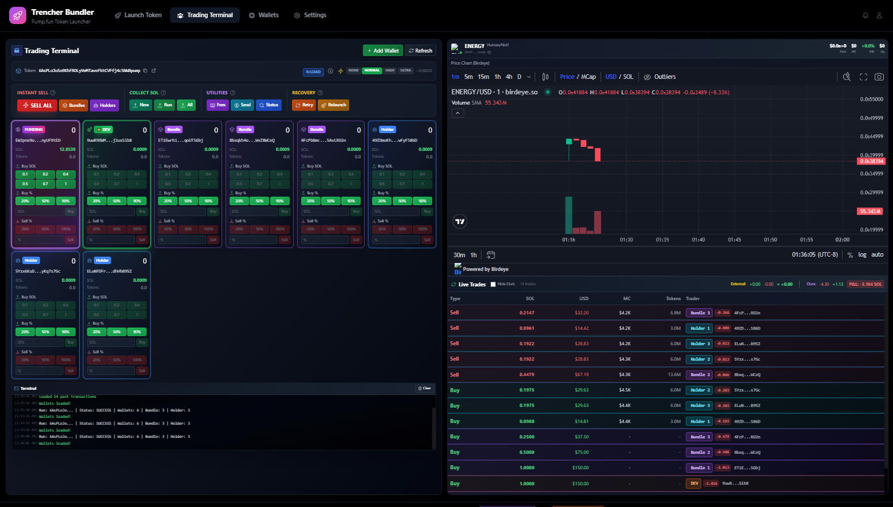
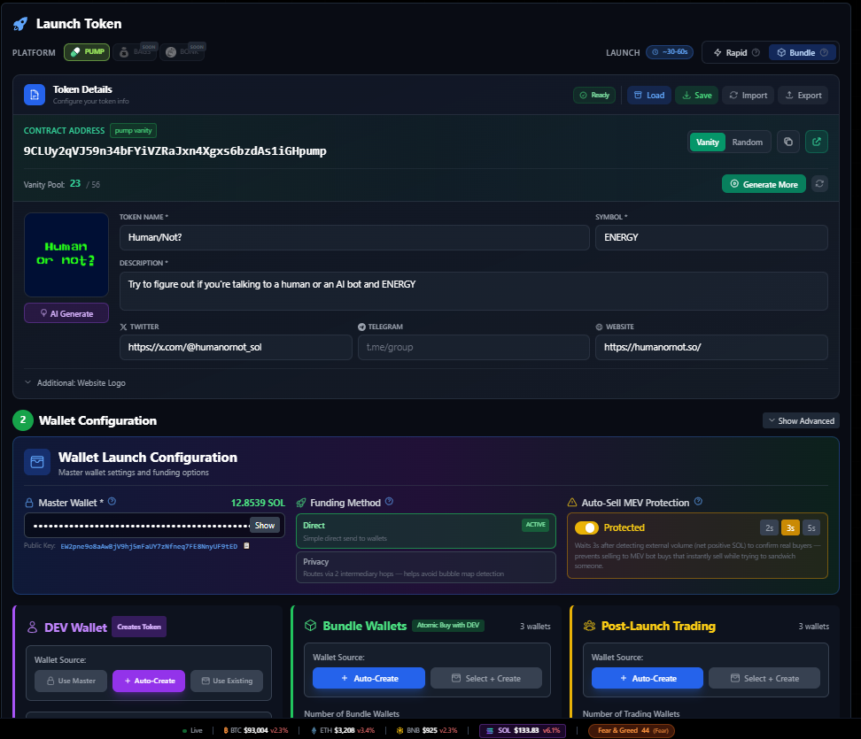
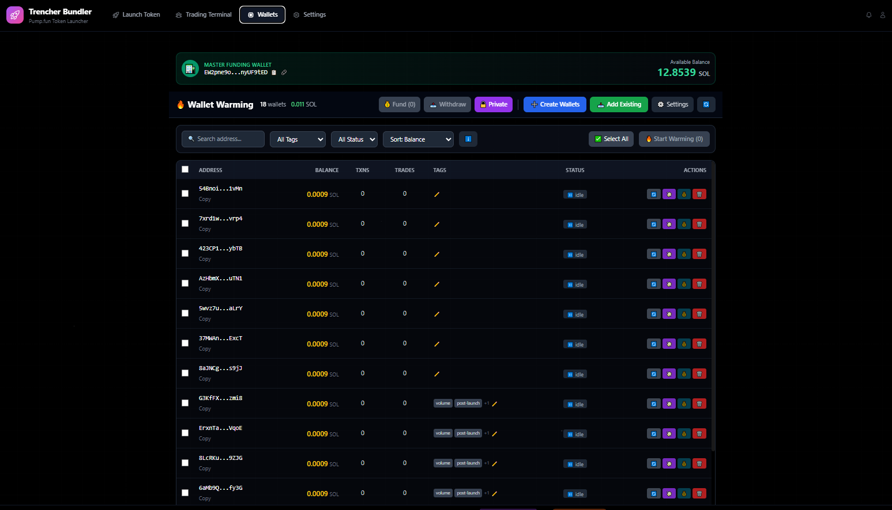

# Pump.fun Bundler Launcher

**The ONLY Pump.fun bundler with a full web dashboard.** Launch tokens, manage wallets, auto-sell, and track P&L — all from one page.

[](https://opensource.org/licenses/MIT)

## 🚀 Quick Overview

Pump.fun bundler that handles everything from launch to profit-taking with a beautiful React dashboard. Uses Jito bundles for coordinated buys, includes auto-sell, wallet management, and real-time P&L tracking.

**Connect with us:**
- Telegram: [@Xekku](https://t.me/xekku)

## ✨ Key Features

- **Single-Page Dashboard** - Complete control from one beautiful UI
- **Jito Bundle Execution** - Launch tokens with coordinated buys in the same block
- **Wallet Management** - Create, warm, and manage unlimited wallets
- **Real-Time P&L Tracking** - Track profits/losses across all wallets
- **Auto-Sell** - Configure automatic selling at price thresholds
- **Rapid Sell** - Instantly sell all positions via Jito bundles
- **Secure Key Management** - All keys saved locally, never exposed
- **Fund Recovery** - Built-in tools to recover stuck SOL from failed launches

## 📸 Screenshots

### Trading Terminal - Main Dashboard

*Real-time trading, P&L tracking, and position management - Our main selling point*

### Token Launch Configuration

*Configure and launch your token with bundled buys*

### Wallet Management

*Create, warm, and manage wallets*

### DEV, Bundle & Holder Wallet Configuration

*Detailed wallet configuration and auto-sell settings*

## ⚡ Quick Start

### Prerequisites

- **Node.js 18+** ([Download](https://nodejs.org/))
- **Solana RPC Endpoint** - Get free Helius RPC: https://helius.dev
- **SOL** for transaction fees and token launches

### Installation

```bash
# Clone the repository
git clone https://github.com/dogtoshi-sz/pumpfun-bundler-launcher-react-dashboard.git
cd pumpfun-bundler-launcher-react-dashboard

# Install root dependencies (automatically creates .env from .env.example)
npm install

# Install API server dependencies
cd api-server
npm install

# Install frontend dependencies
cd ../frontend
npm install
cd ..
```

**✨ Auto-Setup:** The `.env` file is automatically created from `.env.example` during `npm install`. No manual copying needed!

**For Cursor IDE Users:**
- Cursor will automatically detect the `.env.example` file
- When you open the project, Cursor may prompt you to set up environment variables
- You can also ask Cursor: *"Set up the environment variables from .env.example"* and it will help you configure them
- The postinstall script ensures `.env` is created automatically, so you just need to fill in your values

**For Other IDEs (VS Code, WebStorm, etc.):**
- Most modern IDEs will recognize `.env.example` files
- The postinstall script handles the file creation automatically
- Simply edit the auto-generated `.env` file with your credentials

### Configuration

The `.env` file is **automatically created** from `.env.example` when you run `npm install`. If you're using Cursor IDE or other AI-powered editors, they may also help set this up automatically.

**Manual setup (if needed):**

1. **Copy the example environment file** (only if auto-setup didn't work):
   ```bash
   cp .env.example .env
   ```

2. **Edit `.env` with your settings:**
   ```env
   # REQUIRED - Your main funding wallet private key (base58)
   PRIVATE_KEY=your_private_key_here
   
   # REQUIRED - Solana RPC endpoint (use Helius/QuickNode)
   RPC_ENDPOINT=https://mainnet.helius-rpc.com/?api-key=YOUR_KEY
   RPC_WEBSOCKET_ENDPOINT=wss://mainnet.helius-rpc.com/?api-key=YOUR_KEY
   ```

3. **Start both frontend + API server (single command):**
   ```bash
   npm run dev
   ```

   - This is the fastest way to get running.
   - For debugging and cleaner logs, running them separately is recommended (below).

4. **Start the API server** (Terminal 1):
   ```bash
   cd api-server
   npm run dev
   ```

5. **Start the frontend** (Terminal 2):
   ```bash
   cd frontend
   npm run dev
   ```

6. **Open your browser:**
   ```
   http://localhost:5173
   ```

## 📖 Documentation

- **[User Guide](./USER_GUIDE.md)** - Complete documentation with detailed explanations, button reference, troubleshooting, and more
- **[Setup Guide](./SETUP.md)** - Detailed setup instructions
- **[Security Analysis](./SECURITY_ANALYSIS.md)** - Security review and best practices

## 🔧 How It Works (TL;DR)

1. **Token Creation** - Creates your token on Pump.fun
2. **DEV Buy** - First buy from your creator wallet
3. **Bundle Buys** - Multiple wallets buying simultaneously via Jito bundle
4. **Jito Execution** - All transactions bundled and sent via Jito block engine

**Why Jito?** Atomic execution (all buys land in the same block or none do), MEV protection, and faster execution.

## 🛡️ Security

- All wallet keys are saved **locally only** in the `keys/` directory
- The `keys/` folder is **gitignored** by default
- **ALL private keys are automatically saved to `archive.txt`** for recovery
- **Never commit or share your `.env` file or `keys/` folder**

## 🆘 Need Help?

- **Full Documentation:** See [USER_GUIDE.md](./USER_GUIDE.md)
- **Telegram:** [@Xekku](https://t.me/xekku)

## 📄 License

MIT License - see [LICENSE](LICENSE) file for details.

## ⚠️ Disclaimer

This software is provided "as is" without warranty. Use at your own risk. Always test with small amounts first. The authors are not responsible for any losses.

---

**Built for the Solana community by traders, for traders.**
